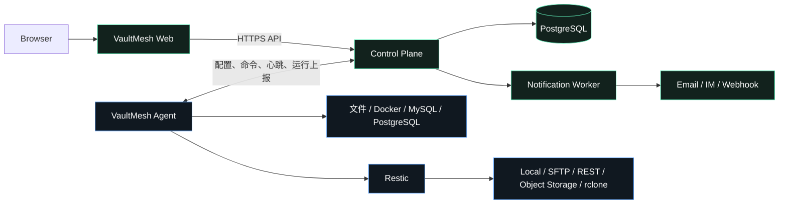

# VaultMesh

[](https://github.com/to-alan/VaultMesh/actions/workflows/ci.yml)
[](./LICENSE)
[](./go.mod)
[](./web/package.json)
[](https://github.com/to-alan/VaultMesh/releases)

面向 Linux VPS、Homelab 和小型技术团队的自托管多服务器备份控制平台。

VaultMesh 使用独立 Control Plane 集中管理服务器、备份项目、执行计划、Restic 仓库、运行状态和恢复流程；轻量 Agent 在源服务器本地执行备份，并把加密数据直接写入用户自己的存储。备份正文不经过控制面。

> [!IMPORTANT]
> VaultMesh 处于 1.0 之前的可运行阶段。请先使用测试数据和独立 Bucket/Prefix 完成备份、校验和恢复演练，再考虑替换现有生产备份方案。

## 快速开始

**一分钟了解**：Control Plane（Docker Compose，含 PostgreSQL）跑在管理主机上；每台要备份的机器跑一个 Agent（单个二进制 + systemd）。在 Web 控制台创建仓库渠道和备份项目，Agent 自动拉取计划并在本地执行 Restic。

### 一键部署控制面

在一台 Linux 主机上（需要 Git、OpenSSL、Docker Engine、Docker Compose v2）：

```bash
curl -fsSL https://raw.githubusercontent.com/to-alan/VaultMesh/main/install.sh | sudo sh
```

安装脚本会安装到 `/opt/vaultmesh`，生成管理员密码与 `VAULTMESH_MASTER_KEY`，**拉取 GHCR 预构建镜像**并启动 Control Plane、Web 和 PostgreSQL（镜像不可用时自动回退为本地构建，需要几分钟）；重复运行保留 `.env` 与数据库卷并快进更新。生产环境建议在 `.env` 中把 `VAULTMESH_IMAGE_TAG` 固定到明确的版本 tag。

不希望直接执行远程脚本时，先审阅：

```bash
curl -fsSLo vaultmesh-install.sh https://raw.githubusercontent.com/to-alan/VaultMesh/main/install.sh
less vaultmesh-install.sh
sudo sh vaultmesh-install.sh
```

服务默认只绑定回环地址：Web `http://localhost:3000`、API `http://localhost:8080`。远程主机先建 SSH 隧道：

```bash
ssh -L 3000:127.0.0.1:3000 -L 8080:127.0.0.1:8080 user@your-server
```

打开 `http://localhost:3000`，用安装脚本输出的账号密码登录。

### 安装 Agent

在 Web 控制台创建“服务器”后，注册卡片会显示一条可直接复制的安装命令（在**要备份的那台机器**上执行）：

```bash
curl -fsSL https://raw.githubusercontent.com/to-alan/VaultMesh/main/install.sh | sudo sh -s -- install-agent 'https://backup.example.com' 'enroll_xxx' '我的VPS'
```

这条命令会自动：下载对应架构的 Agent 二进制并校验 SHA256 → 安装 systemd 服务 → 写入注册信息并启动 → 注册成功后从配置中清除一次性令牌。

也可以从 [Releases](https://github.com/to-alan/VaultMesh/releases) 手动下载（linux/amd64、arm64、armv7、darwin/amd64、arm64，附 SHA256SUMS），或 `make build` 自行构建后按 `deploy/systemd/` 模板手工安装。

Agent 主机依赖：所有备份需要 Restic ≥ 0.17.0；MySQL/PostgreSQL 逻辑备份分别需要 `mysqldump`/`pg_dump`；Docker 挂载需要 Docker CLI；rclone 类存储需要预配置同名 remote。

Agent 与控制面的通信强制 HTTPS（仅 localhost 允许明文）。设备身份保存在 `/var/lib/vaultmesh-agent/state.json`（权限 `0600`）；`vaultmesh-agent --version` 可查看当前版本。

重新注册或卸载：

```bash
# 卸载（保留恢复测试产物）
curl -fsSL https://raw.githubusercontent.com/to-alan/VaultMesh/main/install.sh | sudo sh -s -- uninstall-agent
```

重装时安装器会自动重置旧设备身份；控制台里对应的服务器记录可在页面归档。

### 创建第一份备份

1. 在“备份仓库”创建独立测试渠道（如 Cloudflare R2 专用 Bucket/Prefix）；
2. 在已在线的服务器下创建备份项目，添加文件、Docker 或数据库数据源；
3. 选择时间计划，设置保留、Prune 和 Check 策略；
4. 点击“立即备份”，确认运行状态、快照 ID、文件数和字节数；
5. 进入“快照恢复”，同步快照并恢复一个测试文件到隔离目录完成真实验证。

备份任务显示成功不等于恢复已被证明；第五步不应省略。

### 容器镜像

版本 tag 会自动发布 GHCR 镜像（`ghcr.io/to-alan/vaultmesh/vaultmesh-control`、`vaultmesh-web`、`vaultmesh-agent`）。生产部署固定版本 tag，不要使用 `latest`。本地 Compose 部署见 [compose.yaml](./compose.yaml)。

## 项目概览

| 项目 | 说明 |
|---|---|
| 产品定位 | 多服务器备份控制面，而不是新的备份格式或云存储服务 |
| 执行引擎 | Restic |
| 控制面 | Go API、PostgreSQL、Vue 3 Web |
| 数据面 | Linux Agent 在源服务器本地准备数据并直传仓库 |
| 适用规模 | 个人、多台 VPS、Homelab、小型技术团队 |
| 主要存储 | Local、SFTP、REST、S3 兼容对象存储及受控 rclone 扩展 |
| 安全模型 | 一次性 Agent 注册、设备凭据、Secret 加密、管理员 TOTP/通行密钥 |
| 授权方式 | 公开源码，采用 [PolyForm Noncommercial 1.0.0](./LICENSE)，不授予商业用途 |

## VaultMesh 解决什么问题

当服务器数量增加后，独立的 Restic 脚本和 Cron 很难持续回答这些问题：

- 哪台服务器没有按计划完成备份；
- 哪次运行是完全成功、部分成功、超时还是状态未知；
- 不同项目的快照应保留多少份、何时清理；
- 仓库最近是否完成过 Check；
- 某个恢复点里有什么，以及恢复文件实际写到了哪里；
- 控制面短时离线时，已有备份计划是否仍能执行。

VaultMesh 把分散的脚本升级为一套声明式、可观察、可恢复的备份控制流程，同时继续让 Restic 负责加密、去重、快照和仓库存储。

## 核心能力

| 领域 | 当前能力 |
|---|---|
| 多服务器管理 | 一次性注册令牌、独立设备身份、心跳、配置 Revision、按服务器分组项目 |
| 数据源 | 文件目录、Docker 挂载、MySQL 逻辑导出、PostgreSQL 逻辑导出，可在一个项目中组合 |
| 调度与 RPO | 5 段 Cron、IANA 时区、随机抖动、最长运行时间、完成宽限、迟到/超时推导、立即备份、暂停/恢复 |
| 离线自治 | Agent 持久化最后有效配置；控制面离线时继续调度，并通过 Outbox 延迟上报 |
| 仓库 | 全局存储渠道，与服务器解耦；下发时按 Server ID 派生隔离的 Restic 路径 |
| 保留策略 | 最多 N 份、Smart、GFS、按时间保留、保护标签、真实仓库 dry-run 预览 |
| 仓库维护 | Forget、Prune、Check 可使用独立维护窗口，并与备份共享仓库互斥锁 |
| 快照与恢复 | 快照索引、目录浏览、永久保护、文件/目录恢复到全新隔离目录、禁止覆盖 |
| 运行事实 | `succeeded`、`partial`、`failed`、`timed_out`、`unknown`、`skipped`，终态记录不可回退；重叠触发按 `concurrency_policy=forbid` 记录为跳过 |
| 健康状态 | `healthy`、`pending`、`running`、`late`、`overdue`；执行中的备份不会误报迟到 |
| 生命周期 | 服务器/项目/仓库归档（软删除 + 从 Agent 配置摘除 + 保留历史）；五类控制面数据保留策略 |
| 声明式编辑 | 可原地更新数据源、计划、保留、校验和维护窗口；数据库密码留空安全继承，服务器与仓库锁定以保护恢复链 |
| 账户安全 | 密码、TOTP、一次性恢复码、WebAuthn 通行密钥、敏感操作重新认证、失败尝试渐进限速 |
| 操作审计 | PostgreSQL 追加保存认证、账号安全、配置、备份与恢复操作的结果、来源 IP 和 HTTP 状态 |
| 通知与告警 | 用户自定义 Webhook、Telegram、Email、Slack、Discord、企业微信、钉钉、Gotify、ntfy；`backup_failure`/`rpo_overdue`/`agent_offline`/`config_error` 事件按项目/服务器路由、稳定指纹去重、周期提醒、恢复通知、持久化重试与 SSRF 出站防护 |
| 前后端分离 | Web 与 API 使用独立镜像、端口、类型化客户端和运行时配置；支持精确 Origin CORS 与独立主题 |

## 架构与数据流


```mermaid
flowchart LR
    B["Browser"] --> W["VaultMesh Web"]
    W -->|"HTTPS API"| C["Control Plane"]
    C --> P[("PostgreSQL")]
    C --> N["Notification Worker"]
    N --> T["Email / IM / Webhook"]

    A["VaultMesh Agent"] <-->|"配置、命令、心跳、运行上报"| C
    A --> S["文件 / Docker / MySQL / PostgreSQL"]
    A --> R["Restic"]
    R --> O["Local / SFTP / REST / Object Storage / rclone"]

    classDef control fill:#12221d,stroke:#5ee9b5,color:#ffffff;
    classDef data fill:#101820,stroke:#62a8ff,color:#ffffff;
    class C,W,P,N,T control;
    class A,S,R,O data;
```

关键边界：

1. 备份数据由 Agent 直接写入仓库，不经过 Control Plane。
2. Control Plane 保存策略、加密后的 Secret、快照元数据和运行事实。
3. Agent 不提供任意远程 Shell，只接受有限的强类型任务。
4. 仓库渠道是全局资源；项目分别选择执行服务器和存储渠道。
5. 中心短时不可用不会停止 Agent 已经持有的定时计划。
6. Agent 停止时会取消并等待活跃任务，把终态写入本地 Outbox，避免遗留孤儿备份进程。

组件边界与状态机详见 [架构说明](./docs/ARCHITECTURE.md)。

## 适用与不适用场景

| 适合 | 当前不适合 |
|---|---|
| 统一管理多台 Linux VPS 的 Restic 备份 | Windows、macOS、Kubernetes 原生备份 |
| Homelab 的文件、容器挂载和数据库逻辑备份 | 块设备、虚拟机镜像、CDP |
| 自托管控制面，数据保存在自己的对象存储 | 把 VaultMesh 当作托管云盘或备份数据中转服务 |
| 希望看到运行、计划、快照、保留和恢复过程 | 自动覆盖生产目录并一键重建完整应用栈 |
| 能接受先恢复到隔离目录再人工验收 | 当前就需要多管理员 RBAC 或高可用控制面 |

## 数据源支持

| 类型 | 实现方式 | 一致性边界 |
|---|---|---|
| 文件 | Restic 直接读取配置的绝对路径 | 运行期间仍被修改的文件可能来自不同时间点 |
| Docker | `docker inspect` 生成脱敏清单，并备份显式容器的 bind mount/named volume | 默认是崩溃一致性，不自动停止容器，不备份 writable layer |
| MySQL | 在权限收敛的暂存目录执行事务型逻辑导出，再交给 Restic | 需要兼容的 `mysqldump`；恢复到新实例仍需管理员执行 |
| PostgreSQL | 使用 `pg_dump --format=custom` 生成逻辑导出，再交给 Restic | 需要兼容的 `pg_dump`；恢复到新实例仍需管理员执行 |

数据库容器不应只备份活跃 Volume；应同时配置 MySQL/PostgreSQL 专用数据源。

## 存储支持

| 分类 | 当前支持 |
|---|---|
| Restic 原生 | Local、SFTP、REST Server、Amazon S3、S3 Compatible、OpenStack Swift、Backblaze B2、Azure Blob、Google Cloud Storage |
| S3 厂商预设 | Cloudflare R2、MinIO、Wasabi、阿里云 OSS、腾讯云 COS、华为云 OBS、七牛云 Kodo、Backblaze B2 S3 |
| rclone 扩展 | 通用 rclone、WebDAV、OneDrive、Google Drive、Dropbox |

S3 是对象存储兼容协议，不等于某一家云厂商。Cloudflare R2、MinIO 和其他兼容产品共享 Restic S3 后端，但 Endpoint、Region 和寻址方式可能不同。

完整字段、认证方式和 Agent 前置条件见 [存储仓库支持矩阵](./docs/STORAGE_PROVIDERS.md)。

## 生产部署要点

### 必要配置

| 变量 | 用途 | 生产要求 |
|---|---|---|
| `VAULTMESH_MASTER_KEY` | 加密仓库、数据库来源和账户安全资料 | 随机 32 字节，独立备份，不可丢失 |
| `POSTGRES_PASSWORD` | Compose PostgreSQL 账号 | 使用随机长密码，仅保存在受保护的 `.env` |
| `VAULTMESH_ALLOWED_ORIGINS` | 允许访问 API 的 Web Origin | 精确 HTTPS Origin，禁止通配符 |
| `VAULTMESH_PUBLIC_API_URL` | 浏览器实际访问的 API URL | 使用可信 HTTPS 域名 |
| `VAULTMESH_COOKIE_SECURE` | 为登录 Cookie 启用 Secure | 公网部署必须为 `true` |
| `VAULTMESH_COOKIE_SAME_SITE` | 管理员 Cookie 的跨站策略 | 默认 `lax`；完全跨站前端使用 `none` 且必须启用 Secure |
| `VAULTMESH_WEBAUTHN_RP_ID` | 通行密钥 RP ID | 稳定域名，不包含协议、端口或 IP |
| `VAULTMESH_WEBAUTHN_RP_ORIGINS` | 通行密钥允许的 Origin | 与实际控制台 HTTPS Origin 一致 |
| `VAULTMESH_RETENTION_*_DAYS` | 控制面数据保留天数（运行/命令/投递/事件/审计） | 默认 90/30/90/180/365，`0` 关闭对应清理 |

完整模板见 [.env.example](./.env.example)。

### 上线检查

- Web 和 API 均位于可信 HTTPS 反向代理之后；
- API 端口没有以明文形式直接暴露公网；
- 登录接口已在反向代理或 WAF 设置速率限制；
- 管理员已修改初始密码，并启用 TOTP 或通行密钥；
- 对象存储凭据限制到专用 Bucket/Prefix；
- 已备份 PostgreSQL 和包含主密钥的 `/opt/vaultmesh/.env`；
- 已从真实快照完成文件和数据库恢复演练；
- 仍保留原有生产备份，直到 VaultMesh 的恢复链路经过持续验证。

> [!WARNING]
> PostgreSQL 与 `.env` 必须成对备份。只保留数据库、却丢失 `VAULTMESH_MASTER_KEY`，将无法解密已经保存的仓库凭据、数据库密码和账户安全资料。

备份、恢复、升级、回滚和故障处理步骤见 [运维手册](./docs/OPERATIONS.md)。

## 管理员安全

- 管理员通过用户名和密码登录，浏览器只保存 HttpOnly、SameSite 会话 Cookie；
- 密码和 TOTP 失败按客户端分别计数；15 分钟内连续失败 5 次会触发 1 至 15 分钟渐进锁定，并返回 `Retry-After`；
- 可启用 TOTP 二步验证，并生成仅展示一次的恢复码；
- 可注册 Touch ID、Windows Hello、设备 PIN 或硬件安全密钥；
- 添加/删除通行密钥需要最近 10 分钟内完成身份验证；
- 修改密码或停用二步验证会撤销现有会话；
- 认证、账号安全、配置、备份和恢复类操作写入持久化审计表；请求正文和 Secret 不进入审计事件；
- WebAuthn 本地开发必须使用 `localhost`，生产环境必须使用稳定的 HTTPS 域名。

更多要求见 [安全策略](./SECURITY.md)。

## 当前限制

| 领域 | 当前限制 | 建议 |
|---|---|---|
| 发布状态 | 尚未发布稳定版本；版本 tag 会自动产出 Agent 二进制、SHA256SUMS 和 GHCR 容器镜像，暂无自动升级通道 | 固定经过验证的版本 tag（容器镜像同样固定 tag，不用 `latest`），升级前备份控制面 |
| 管理员 | 单管理员、无 RBAC 和密码找回 | 保护恢复码，并限制管理端访问来源 |
| 登录防护 | 已有进程内登录/TOTP 渐进限速，但重启会清空且多副本不共享 | 仍在反向代理/WAF 配置持久或分布式限速 |
| 审计 | 事件追加保存在控制面 PostgreSQL，暂无请求关联 ID、字段差异和外部防篡改归档 | 同步到独立日志系统，并为控制面数据库设置保留与访问策略 |
| 控制面扩展 | 会话仅保存在单个进程，不支持多副本共享 | 当前只运行一个 Control Plane 实例 |
| 仓库验证 | 保存时只校验字段和 URL；首次 Restic 操作才验证连通性 | 先使用测试 Bucket/Prefix 执行快照操作 |
| 错过运行 | 当前只支持 `missed_run_policy=skip` | 通过下次任务倒计时和运行历史确认计划 |
| 告警范围 | 当前自动事件为备份运行失败、`overdue`、Agent 离线和配置降级；尚无仓库 Check 失败、静默时段和多级升级 | 分别配置项目/服务器路由与重复周期；关键环境仍保留独立监控与升级机制 |
| 生命周期 | 服务器、项目、仓库支持归档（软删除 + 从 Agent 配置摘除 + 保留历史）；暂无彻底删除与归档恢复 | 归档前确认恢复链不再需要；历史数据按控制面保留策略清理 |
| Docker | Volume 默认只有崩溃一致性 | 数据库容器同时配置逻辑导出 |
| 不可变性 | 保护标签只影响 Restic Forget，不等于 Object Lock | 在存储层配置版本控制/Object Lock/独立删除身份 |
| 恢复 | 只支持同 Agent 隔离恢复，不自动回写生产路径 | 验收恢复内容后由管理员受控迁移 |

## 本地开发

要求 Go 1.26.6、Node.js 24 和 npm。省略 `VAULTMESH_DATABASE_URL` 时会使用内存存储，进程重启后开发数据丢失。

```bash
npm --prefix web install
make check
make build
```

启动本地 API：

```bash
export VAULTMESH_ADMIN_USERNAME=admin
export VAULTMESH_ADMIN_PASSWORD="$(openssl rand -hex 16)"
export VAULTMESH_MASTER_KEY="$(openssl rand -base64 32)"
export VAULTMESH_ALLOWED_ORIGINS=http://localhost:5173
export VAULTMESH_COOKIE_SECURE=false
./bin/vaultmesh-server
```

另开终端启动前端：

```bash
npm --prefix web run dev
```

CI 会执行：

- Go 全量测试和竞态检测；
- `go vet` 与 Govulncheck；
- 前端 Vitest、TypeScript 生产构建与 npm 高危漏洞审计；
- Control Plane、Web、Agent 三个容器镜像构建；
- 独立 Web/API 容器烟雾测试。

## 仓库结构

| 路径 | 内容 |
|---|---|
| `cmd/vaultmesh-server` | Control Plane 入口 |
| `cmd/vaultmesh-agent` | Linux Agent 入口 |
| `internal/control` | API、业务服务、仓库/告警与按认证方式拆分的安全模块 |
| `internal/agent` | 调度、本地状态、Restic/数据库/Docker 执行 |
| `internal/store` | Memory/PostgreSQL 数据存储 |
| `web` | Vue 3 + TypeScript 管理界面 |
| `web/src/services` | 独立前端可复用的类型化 Control Plane API 层 |
| `deploy/systemd` | Agent systemd Unit 与环境模板 |
| `docs` | API、架构、仓库、备份策略、恢复和运维文档 |

## 文档导航

| 文档 | 适合解决的问题 |
|---|---|
| [快速开始](#快速开始) | 部署控制面、安装 Agent、创建第一份备份 |
| [架构说明](./docs/ARCHITECTURE.md) | 组件边界、数据流、运行/配置/告警状态机 |
| [项目说明书](./VaultMesh-项目说明书.md) | 产品边界、当前实现、路线图、核心技术难点 |
| [开发与扩展指南](./docs/DEVELOPMENT.md) | 模块边界、扩展 Provider/仓库/数据源的约定和检查清单 |
| [贡献指南](./CONTRIBUTING.md) | 本地开发环境、测试约定、提交规范 |
| [更新日志](./CHANGELOG.md) | 每个版本的变更与已知限制 |
| [API Reference](./docs/API.md) | 登录、仓库、项目、快照和恢复接口示例 |
| [前端 API 对接指南](./docs/FRONTEND_INTEGRATION.md) | 更换主题、独立域名部署、Cookie/CORS 和统一错误处理 |
| [OpenAPI 3.1](./docs/openapi.yaml) | 可导入 Swagger、Redoc 或代码生成器的机器可读契约 |
| [存储仓库支持矩阵](./docs/STORAGE_PROVIDERS.md) | 每类存储需要填写什么、凭据如何配置 |
| [备份项目策略](./docs/BACKUP_PROJECTS.md) | 数据源、扫描边界、保留、Check 和维护窗口 |
| [通知与告警](./docs/NOTIFICATIONS.md) | 渠道字段、事件路由、去重/恢复语义、重试和安全边界 |
| [快照浏览与安全恢复](./docs/SNAPSHOT_RECOVERY.md) | 快照同步、目录浏览、保护和隔离恢复 |
| [运维手册](./docs/OPERATIONS.md) | 控制面备份恢复、升级回滚和故障处理 |
| [安全策略](./SECURITY.md) | 漏洞报告和生产安全要求 |

## 许可证

VaultMesh 采用 [PolyForm Noncommercial License 1.0.0](./LICENSE)：

- 允许许可证定义范围内的个人学习、研究、实验、测试和爱好用途；
- 允许符合条款定义的慈善、教育、公共研究、公共安全/健康、环保和政府机构使用；
- 不授予商业用途；商业部署、托管服务、商业集成或其他不属于 permitted purpose 的使用需要另行取得商业授权；
- 再分发时必须同时提供许可证条款和 Required Notice（如有）。

非商业限制意味着本项目属于 **source-available（公开源码）**，不属于 OSI 定义的 Open Source Software。具体权利与限制以 [LICENSE](./LICENSE) 原文为准；如需商业授权，请联系仓库所有者。

参考：[PolyForm Noncommercial 官方说明](https://polyformproject.org/licenses/noncommercial/1.0.0)、[OSI Open Source Definition](https://opensource.org/osd)。

## 反馈与贡献

- 普通缺陷和功能建议可通过 GitHub Issues 提交；
- Pull Request 请先阅读[贡献指南](./CONTRIBUTING.md)，保持任务边界清晰，并包含相应测试和文档；
- 安全问题不要创建公开 Issue，请按照 [SECURITY.md](./SECURITY.md) 私下报告；
- 提交贡献前请先阅读本仓库许可证；如涉及商业授权或较大范围合作，请先联系仓库所有者确认边界。
