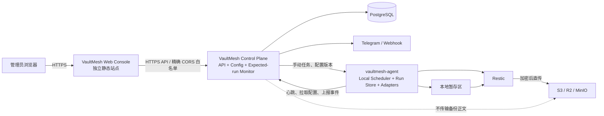
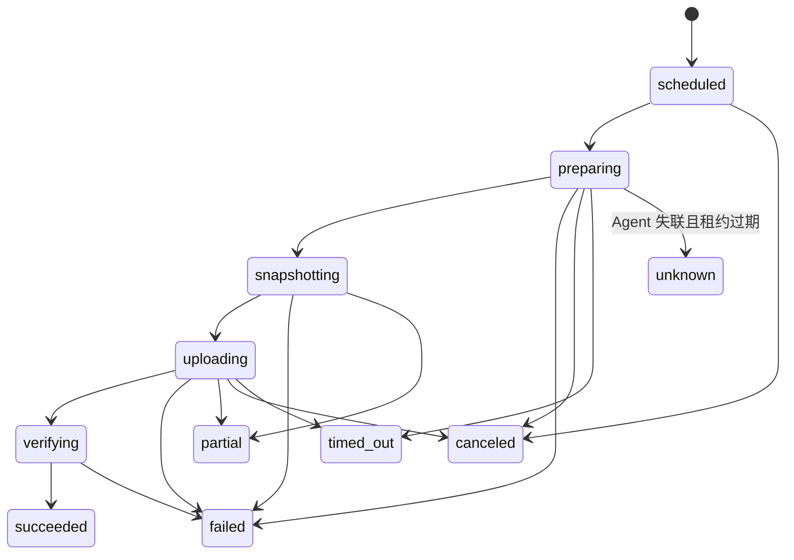

# VaultMesh 项目说明书

> 文档版本：0.2（立项评审稿）
> 更新日期：2026-07-14
> 文档状态：用于范围确认、架构评审和 MVP 拆解，不代表已经进入实现
> 目标读者：项目发起人、产品设计者、后端/Agent/前端开发者、测试与运维人员

---

## 0. 执行摘要

VaultMesh 的方向成立，真实需求也足够清晰：拥有多台 VPS 或 Homelab 主机的用户，通常已经会使用 Restic、脚本和 Cron，但缺少一个能集中回答以下问题的系统：

- 哪些服务器按计划完成了备份；
- 哪些任务已经超过恢复点目标（RPO）；
- 备份是否完整、是否仍可读取；
- 快照保存在哪里、保留多久、何时应清理；
- 出现故障时，如何安全且可重复地完成恢复。

项目不应被定义为“又一个备份引擎”，而应被定义为：

> **一个面向 Linux VPS、Homelab 和小团队的自托管备份控制平台。它以成熟备份引擎为数据执行层，统一管理多主机的备份策略、运行状态、验证、告警与恢复流程。**

项目可行，但工程复杂度不能按“做一个 Dashboard，再远程调用 Restic”估算。真正困难的部分是备份一致性、断网与重试语义、凭据和 Agent 权限、仓库并发、保留策略、恢复防误操作，以及“成功”状态能否真实代表可恢复。

本说明书建议采用以下原则：

1. **控制面与数据面分离**：备份数据由 Agent 直接写入目标存储，不经过 VaultMesh 中心服务。
2. **Agent 自主执行定时任务**：中心下发版本化策略，Agent 本地持久化并调度；中心短时不可用时，既有备份仍继续运行。
3. **MVP 只支持明确可验证的能力**：Linux、文件、MySQL/PostgreSQL 逻辑备份、S3 兼容存储、快照与状态、保留策略、校验、受控恢复。
4. **不把 Docker 自动发现等同于自动正确备份**：发现只能生成候选配置，数据库一致性仍必须由专用适配器保证。
5. **恢复优先于功能数量**：没有经过恢复验证的备份，只能称为“已上传的数据”，不能被产品宣传为可恢复备份。

### 0.1 立项结论

建议立项，但必须先完成一个纵向技术验证：单台 Agent 从配置同步、数据库导出、Restic 上传、运行上报，到空目录恢复和校验完整走通。该验证通过后，再开始扩展 Dashboard、自动发现和多存储预设。

不建议在首版同时承诺 Redis、SSH Storage、Borg、Kopia、自动恢复整个 Docker 应用、多租户 RBAC、高可用控制面和恢复测试沙箱。这些能力会显著放大测试矩阵，并掩盖核心链路的可靠性问题。

---

## 1. 对原始构想的专业评审

原始构想已经覆盖了产品外形，但缺少可执行的边界、失败语义和安全约束。以下问题需要在研发前修正。

| 编号 | 原构想中的问题 | 风险 | 建议修改 |
|---|---|---|---|
| R-01 | 产品边界同时覆盖编排、备份引擎、服务发现和一键恢复 | 首版范围失控，难以形成可靠闭环 | 明确 VaultMesh 是控制平台；MVP 固定使用 Restic，不自研备份格式 |
| R-02 | 架构图让 Message Queue、Agent、Storage Provider 关系不清 | 容易实现成备份数据经中心转发，造成带宽瓶颈和单点故障 | 数据始终由 Agent 直传存储；中心只保存配置、元数据和运行事件 |
| R-03 | 完全依赖中心 Scheduler 下发每次任务 | 控制面宕机会导致所有主机停止备份 | 定时策略由中心管理、Agent 本地持久化执行；手动任务才要求中心在线 |
| R-04 | “备份 Docker Volume”没有一致性定义 | 活跃数据库卷可能被备份成不可恢复状态 | Docker 发现只做盘点；数据库优先逻辑导出，文件卷需停写、快照或明确接受崩溃一致性 |
| R-05 | 恢复流程被描述为下载、覆盖、启动 Docker | 可能覆盖生产数据，且无法处理版本、权限、依赖和回滚 | MVP 默认恢复到新目录；先生成恢复计划、校验空间与冲突，再经二次确认执行 |
| R-06 | 只写“Restic Encryption”和 Agent Token | 只解决部分保密性，没有解决凭据泄漏、重放、删除备份和远程提权 | 增加一次性注册、设备凭据轮换、Secret 加密、最小权限、审计和恢复授权 |
| R-07 | Agent 未定义权限边界 | Root Agent 或 Docker Socket 一旦被利用，相当于主机 Root 被控制 | Agent 不提供通用远程 Shell；采用类型化任务；特权能力拆分并最小化 |
| R-08 | “成功/失败”只有二态 | Restic 部分文件不可读、上报中断或进程失联会被误判 | 引入 `partial`、`timed_out`、`unknown` 等状态和明确的终态规则 |
| R-09 | 未定义任务幂等、租约、超时和重入 | 断网重连后可能重复运行、并发写同一仓库或永久卡住 | 每个计划时间点生成确定性幂等键；Agent 本地去重；每仓库执行并发受控 |
| R-10 | 保留策略只列 Daily/Weekly/Monthly | 清理可能误删快照；`prune` 还会带来较大 I/O 和带宽成本 | 先 `dry-run` 预览，再独立维护窗口执行；设置最低保留量和最近成功快照保护 |
| R-11 | 没有仓库拓扑设计 | 把存储账号硬绑定服务器会重复配置；多个 Agent 共用同一 Restic 路径又会扩大损坏半径 | 存储渠道作为全局资源；下发时按服务器派生独立 Restic 路径，项目用标签区分 |
| R-12 | 没有区分“备份成功”和“可恢复” | Dashboard 绿色状态可能制造虚假安全感 | 分别展示运行成功、仓库校验、最近恢复演练和 RPO 健康度 |
| R-13 | 数据模型过薄 | 无法表达任务版本、步骤、尝试次数、Secret、审计和恢复记录 | 使用 Project、Source、Repository、Policy、Run、RunStep、Snapshot、RestoreRun 等实体 |
| R-14 | Agent 计划以 Docker 容器运行 | 读取宿主文件、执行数据库工具和访问 Docker Socket 时挂载复杂且权限过大 | Linux 首版优先原生二进制 + systemd；容器部署作为受限的可选方式 |
| R-15 | 首版技术栈包含 PostgreSQL、Redis、消息队列和多个服务 | 运维复杂度高于目标用户预期 | MVP 使用单个控制面服务 + PostgreSQL；可靠任务状态先落数据库，不强制 Redis/MQ |
| R-16 | “竞品没有该能力”的结论缺少持续验证 | 容易建立在过时或不完整的市场判断上 | 单独维护竞品矩阵，按多主机、远程控制、恢复、验证、权限和部署成本逐项实测 |

### 1.1 最需要修正的产品认知

VaultMesh 的核心价值不是“把命令放到网页上执行”，而是建立一套可信的备份控制闭环：

```text
定义策略 → 按时执行 → 识别部分失败 → 记录不可变运行事实
→ 检查仓库 → 发现超过 RPO → 发出有效告警 → 安全恢复 → 留下审计证据
```

如果只完成前半段，项目会成为远程 Cron 管理器；只有完成验证和恢复，才是备份管理平台。

---

## 2. 产品定义

### 2.1 产品定位

VaultMesh 是一个开源、自托管、多服务器的备份控制平台，负责：

- 统一描述备份对象、目标仓库、时间策略和保留策略；
- 向服务器 Agent 同步期望配置；
- 汇总备份、校验、清理和恢复的运行事实；
- 发现静默失败、超时、部分成功和 RPO 违约；
- 提供受控、可审计的恢复流程。

VaultMesh 不负责：

- 自创备份文件格式、加密算法或去重算法；
- 将用户备份数据中转到中心服务器；
- 提供任意命令远程执行能力；
- 在未验证应用一致性的情况下承诺“一键恢复所有 Docker 服务”。

### 2.2 目标用户

1. **VPS 用户**：管理约 3–50 台 Linux VPS，已有脚本或 Restic 使用经验，但缺乏统一可见性。
2. **Homelab 用户**：拥有 NAS、Docker 主机、数据库和多种 S3 兼容存储，希望自托管控制面。
3. **小型技术团队**：没有专职备份管理员，需要低运维成本、清晰告警和可审计恢复。

首版不以大型企业、Windows 桌面终端、虚拟机整机镜像和 Kubernetes 集群备份为目标。

### 2.3 核心价值主张

- **集中可见**：一个界面查看所有服务器最近成功备份、RPO 健康度和失败原因。
- **统一策略**：通过版本化配置管理备份对象、计划、保留和验证。
- **断网可运行**：控制面短时不可用时，Agent 仍能按已同步策略执行。
- **数据不绕行**：备份内容从源服务器直接进入用户自己的存储。
- **恢复可审计**：恢复先计划、后执行，默认不覆盖生产路径，并记录操作者和结果。

### 2.4 产品设计原则

1. 安全失败优先于静默成功。
2. 恢复能力优先于功能数量。
3. 类型化操作优先于通用 Shell。
4. 本地自治优先于对中心持续在线的依赖。
5. 显式配置优先于危险的自动推断。
6. 单机易部署优先于过早分布式化。
7. 所有高风险动作必须可预览、可确认、可审计。

---

## 3. 产品范围与优先级

### 3.1 MVP（P0）范围

| 能力 | P0 说明 | 最低验收标准 |
|---|---|---|
| 用户与登录 | 单工作区、单管理员或少量管理员 | 密码安全存储；会话可撤销；关键操作要求重新确认 |
| Server/Agent 管理 | Linux amd64/arm64；注册、心跳、版本和状态 | 一次性注册码有过期时间且只能使用一次；设备凭据可吊销与轮换 |
| 配置同步 | 中心维护期望配置，Agent 持久化最后一个有效版本 | 中心断开和 Agent 重启后，既有定时任务仍可执行；无效配置不会替换有效配置 |
| 备份源 | 普通文件目录、MySQL 逻辑导出、PostgreSQL 逻辑导出 | 每种类型有明确的一致性说明；Secret 不出现在任务日志中 |
| 存储 | S3 Compatible；提供 AWS S3、Cloudflare R2、MinIO 参数预设 | 创建前完成连通性、读写、列表和清理能力探测；错误可定位 |
| 备份引擎 | 固定 Restic，记录受支持版本范围 | 解析结构化输出和退出码；部分文件未读取不得标记为完全成功 |
| 计划任务 | 5 段 Cron、IANA 时区、手动运行、错过运行策略、并发策略 | 同一计划时间点至多产生一个逻辑 Run；默认禁止同仓库维护操作并发 |
| 运行记录 | 展示阶段、耗时、处理数据量、新增数据量、快照 ID、错误摘要 | Agent 崩溃、失联、超时和重试均能得到可解释状态 |
| 快照 | 从 Agent 同步 Restic 快照元数据 | 中心不持有备份文件也能按服务器、项目、时间筛选快照 |
| 保留与清理 | 按标签应用保留策略；清理前预览；Prune 使用独立维护窗口 | 永不在备份失败后触发清理；保留最近成功快照；操作留审计记录 |
| 完整性检查 | 周期执行仓库元数据检查，并允许配置抽样数据检查 | 检查结果与最近备份成功状态分开展示；失败触发告警 |
| 文件恢复 | 选择快照和路径，默认恢复到新的暂存目录 | 执行前显示目标、空间、冲突策略；默认拒绝覆盖；结果可审计 |
| 数据库恢复 | P0 提供导出产物定位、校验和受控下载/恢复指引 | 不宣称自动恢复；用户能明确取得对应版本的数据库导出产物 |
| 通知 | Telegram 与通用 Webhook | 支持失败、连续失败、RPO 超时、恢复和校验失败；具备去重与恢复通知 |
| 审计与日志 | 结构化运行事件、操作审计、日志脱敏和大小限制 | 密码、Token、连接串和环境变量中的 Secret 不得出现在 UI 或通知中 |

### 3.2 P1 范围

- Docker/Compose 只读发现与备份方案建议；
- Redis 专用备份适配器；
- MySQL/PostgreSQL 自动恢复到新实例；
- 可调度的恢复演练和恢复结果证明；
- 多管理员 RBAC；
- 第二存储目标或跨仓库复制；
- Agent 灰度升级、签名校验和版本策略；
- Append-only 网关或其他抗删除增强模式；
- Email、Slack 等更多通知渠道。

### 3.3 明确不进入首版

- Windows/macOS Agent；
- 裸机、块设备、虚拟机镜像和持续数据保护（CDP）；
- Kubernetes 原生资源与 CSI 快照；
- Borg、Kopia 等多备份引擎抽象；
- 任意远程 Shell、脚本市场或插件市场；
- 跨地域控制面高可用；
- 自动覆盖生产目录并重启完整应用栈；
- 面向不可信租户的 SaaS 多租户隔离。

---

## 4. 核心使用场景

### 4.1 首次接入服务器

1. 管理员在控制面创建服务器，得到短时有效的一次性注册码。
2. 在目标服务器安装原生 Agent。
3. Agent 本地生成设备凭据，使用注册码完成绑定。
4. 控制面显示主机名、系统、架构、Agent 版本、最近心跳和能力探测结果。
5. 管理员创建存储、项目、备份源和计划。
6. Agent 校验配置后持久化，并回报已应用的配置版本。

### 4.2 正常定时备份

1. Agent 本地调度器到点生成确定性 Run ID。
2. 获取本机仓库执行锁，检查磁盘临时空间和依赖工具。
3. 通过类型化适配器生成一致性产物，如数据库 Dump。
4. 调用 Restic 将文件与临时产物直接写入对象存储。
5. 解析结构化结果，取得快照 ID 和数据统计。
6. 删除临时明文产物，保存本地运行记录并上报中心。
7. 中心更新 RPO、状态和通知；中心离线时 Agent 延迟上报。

### 4.3 发现静默失败

即使 Agent 没有报告“失败”，控制面也必须根据计划推导期望运行时间。如果某任务超过“计划时间 + 最大允许延迟”仍没有成功终态，应标记为 RPO 风险并通知。这能发现 Agent 离线、中心失联、进程未启动、时钟错误等没有正常错误日志的情况。

### 4.4 文件恢复

1. 管理员选择服务器、项目、快照和待恢复路径。
2. 系统生成恢复计划：来源、目标、预计大小、冲突策略、权限处理和校验方式。
3. Agent 检查仓库可读性、目标空间和目标路径安全边界。
4. 默认恢复到 VaultMesh 管理的暂存目录。
5. 完成后显示文件数量、校验结果和后续人工切换指引。
6. 覆盖现有路径必须是单独的高风险流程，不与默认恢复共用一个按钮。

---

## 5. 推荐系统架构



### 5.1 控制面与数据面

**控制面**保存：

- 用户、服务器和 Agent 身份；
- 项目、来源、仓库、计划、保留和验证策略；
- Secret 的加密封装或 Secret 引用；
- 运行事件、快照元数据、恢复记录、告警和审计日志。

**数据面**位于每台 Agent：

- 读取本机文件和数据库；
- 生成临时一致性产物；
- 调用 Restic 完成加密、去重、上传和恢复；
- 本地保存最后有效配置与尚未上报的运行事实。

备份正文不进入控制面数据库、日志、消息队列或 WebSocket。

### 5.2 组件职责

| 组件 | 职责 | 不应承担的职责 |
|---|---|---|
| Web UI | 配置、可视化、恢复计划、审计查询 | 直接拼装 Shell 命令 |
| Control Plane | 身份、策略、期望运行监测、事件汇总、通知 | 代理备份流量、读取用户文件 |
| PostgreSQL | 权威配置和运行元数据 | 存储备份正文或大体积原始日志 |
| Agent | 本地调度、能力探测、适配器执行、Restic 管理、离线上报 | 暴露任意远程命令接口 |
| Source Adapter | 将某类数据转为可备份且可恢复的产物 | 猜测未知应用的一致性规则 |
| Restic | 加密、去重、快照、上传、校验和文件恢复 | 业务调度、用户权限、告警 |

### 5.3 为什么 MVP 不需要 Redis 和独立消息队列

VaultMesh 首版是面向自托管的中小规模系统。配置、运行状态和通知 Outbox 可以先由 PostgreSQL 事务保证；Agent 的计划任务在本地执行。此时加入 Redis 和独立消息队列不会消除主要可靠性风险，反而增加部署、备份和升级负担。

当出现以下条件时再引入队列：控制面多副本、持续高频事件、数千 Agent 长连接、通知和事件处理明显阻塞主事务。届时优先采用支持持久化、消费确认和重放的队列，而不是把内存 Pub/Sub 当作任务事实来源。

### 5.4 通信方式

推荐 P0 协议：

- 配置拉取、心跳、运行上报：版本化 HTTPS API；
- 实时进度和手动任务：由 Agent 主动建立的 WSS 长连接；
- WSS 不可用时：手动任务可通过短轮询降级；
- 所有消息包含协议版本、Agent ID、消息 ID、时间和幂等键；
- 中心从不向 Agent 下发自由格式命令行。

这种方式只要求 Agent 出站访问 443，适合 NAT 后的 VPS 和 Homelab，也比首版强制 gRPC/HTTP2 更容易适配常见反向代理。

### 5.5 中心故障时的行为

- Agent 继续执行已经确认生效的定时配置；
- Agent 将运行事件持久化在本地，恢复连接后按顺序补报；
- 手动任务、配置修改和通知暂停；
- 中心恢复后以事件 ID 去重，不重复创建逻辑 Run；
- 控制面数据库恢复不能改变已经发生的 Agent 运行事实。

---

## 6. 调度、任务与状态语义

### 6.1 配置版本

每台 Agent 有一个单调递增的 `desired_revision`。Agent 只在完成以下校验后更新 `applied_revision`：

- Schema 和协议版本兼容；
- Source Adapter 与外部工具存在；
- 路径位于允许范围内；
- Secret 引用可解析；
- 存储配置可访问；
- 计划和保留策略合法。

新配置无效时，Agent 必须继续使用上一份有效配置，并向中心报告拒绝原因，不能让错误配置清空全部任务。

### 6.2 调度字段

每个 Schedule 至少包含：

- 5 段 Cron 表达式；
- IANA 时区，例如 `Asia/Shanghai`；
- 随机抖动窗口，避免多主机同时上传；
- `missed_run_policy`：`skip` 或 `run_once`；
- `concurrency_policy`：MVP 固定或默认 `forbid`；
- 最大运行时长；
- RPO 阈值；
- 启用状态和配置版本。

不应依赖服务器本地默认时区，也不能把“每 24 小时”与“每天当地时间 02:00”视为同一语义。

### 6.3 幂等与重复执行

计划任务的逻辑幂等键建议为：

```text
workspace_id + schedule_id + scheduled_at_utc
```

Agent 本地数据库和中心数据库均对该键建立唯一约束。网络超时只能产生新的 `attempt`，不能产生第二个逻辑 Run。手动任务由中心生成全局唯一 Run ID。

### 6.4 状态机



终态定义：

- `succeeded`：所有必需步骤成功、Restic 创建快照、结果已解析；
- `partial`：已创建快照，但存在未读取文件、可选来源失败或其他不完整情况；
- `failed`：没有形成满足策略的快照，或必需步骤失败；
- `canceled`：收到取消并已确认执行停止；
- `timed_out`：超过最大运行时长并完成终止处理；
- `unknown`：Agent 失联，无法确认远端进程是否仍运行；连接恢复后允许校正为真实终态。

“命令返回 0”不是唯一成功依据。必须结合适配器步骤、Restic 结构化输出、快照 ID 和退出码判断。

### 6.5 仓库并发

MVP 应在 Agent 侧按 `repository_id` 建立执行锁：

- 同一仓库默认一次只执行一个写任务；
- `forget`、`prune`、修复类操作必须独占；
- 恢复和检查是否允许并发，按 Restic 支持情况和实际压测结果决定；
- 锁必须有持有者、心跳和过期恢复机制，不能只靠内存互斥量。

---

## 7. 备份源与一致性模型

### 7.1 一致性等级

UI 和运行记录必须明确显示每个 Source 的一致性等级：

| 等级 | 含义 | 典型来源 |
|---|---|---|
| Application-consistent | 通过应用原生机制得到事务一致产物 | MySQL/PostgreSQL 逻辑 Dump |
| Filesystem-snapshot-consistent | 来自同一时点的文件系统快照 | 后续可能支持 LVM/ZFS/Btrfs 快照 |
| Crash-consistent | 类似突然断电后的磁盘状态 | 未停写的普通目录或 Docker Volume |
| Best-effort | 备份期间文件可能变化，部分文件甚至不可读 | 普通在线文件扫描 |

不能把以上等级都显示为同一种绿色“备份成功”。

### 7.2 文件来源

P0 支持：绝对路径、排除规则、跨文件系统开关、符号链接策略、文件大小/类型限制和可读性预检查。

要求：

- 路径先 `clean`、解析符号链接并验证允许根目录，防止路径穿越；
- `/proc`、`/sys`、`/dev`、Agent Secret 目录和暂存目录默认拒绝或排除；
- 记录无法读取的文件，并将结果判为 `partial` 或 `failed`，由策略决定；
- 不保证活跃数据库文件的一致性；检测到常见数据库数据目录时应给出警告。

### 7.3 MySQL 来源

首版采用逻辑备份，不直接复制活动数据目录：

- 对以 InnoDB 为主的数据库使用一致性事务快照；
- 记录服务器版本、字符集、目标数据库和导出工具版本；
- 根据恢复目标决定是否包含 routines、events、triggers；
- DDL 变更和非事务表需要明确限制或维护窗口；
- 凭据通过受保护文件、文件描述符或受控环境注入，不出现在进程参数和日志中；
- Dump 先写入权限为 `0600` 的暂存目录，备份完成后可靠清理。

### 7.4 PostgreSQL 来源

首版采用 `pg_dump` 逻辑备份：

- 默认使用便于并行恢复和选择性恢复的归档格式；
- 数据库内容与集群级角色/权限分开处理；
- 记录服务端版本和客户端工具版本；
- 多数据库项目逐库生成产物并分别记录步骤状态；
- 文件级复制 PostgreSQL 数据目录不进入 P0，除非停库或有经过验证的同时点快照方案。

### 7.5 Redis 来源

Redis 放入 P1。原因不是命令难，而是必须定义 RDB/AOF 策略、持久化配置、复制拓扑、数据落盘完成判定和恢复目标。直接对活动 Redis 目录执行 Restic 不能被默认为应用一致备份。

### 7.6 Docker 自动发现

Docker 发现只输出候选信息：容器名、镜像、Compose Project、Mount、Volume、端口、健康状态和可能的数据库类型。它不能自动确定：

- 哪个 Volume 是权威数据；
- 数据库凭据和备份权限；
- 应用是否需要停写；
- 恢复顺序和版本兼容性；
- 外部依赖是否也已备份。

特别注意：`docker inspect` 和 Compose 配置可能含明文环境变量。中心默认只接收经过白名单过滤的元数据，不能把完整环境变量上传到控制面。

### 7.7 Hook 与自定义命令

P0 不从 Web UI 下发任意 pre/post Shell。数据库备份使用内置的类型化 Adapter。未来如增加 Hook，应满足：默认禁用、只能由主机本地管理员启用、固定工作目录、超时、输出脱敏、环境变量白名单和明确的审计标记。

---

## 8. 仓库、存储与保留策略

### 8.1 仓库拓扑

推荐默认模型：

```text
一个 Server × 一个 Storage Target = 一个 Restic Repository
```

同一服务器上的多个 Project 使用不可变 ID 标签隔离，例如：

```text
vaultmesh.project_id=<uuid>
vaultmesh.source_id=<uuid>
vaultmesh.schedule_id=<uuid>
```

这样可以在服务器内部获得一定去重收益，同时把凭据泄漏和仓库损坏的影响范围限制在单台服务器。禁止多个互不信任的 Agent 共享一个仓库密码和写权限。

对象存储前缀使用稳定 ID，而不是可修改名称：

```text
vaultmesh/<workspace-id>/<server-id>/restic
```

### 8.2 存储能力探测

“S3 Compatible”不是完全一致的行为保证。创建仓库前应进行小范围探测：

- Endpoint、Region、Path-style/Virtual-hosted-style；
- TLS 与证书；
- 列表、读取、创建、覆盖和删除行为；
- 时钟偏差与请求签名；
- 分段上传和超时；
- Bucket/Prefix 权限；
- Provider 是否具备版本控制、对象锁或生命周期能力。

探测结果应形成 capability 记录，不能仅以“连接成功”代替可用性验证。

### 8.3 Secret 与仓库密码

P0 推荐“中心托管加密 Secret”模式，便于重新下发与灾后恢复：

- 数据库只保存信封加密后的密文；
- 主密钥通过部署环境或外部 Secret Manager 提供，不写入数据库；
- Secret 只下发给绑定的目标 Agent；
- UI 创建后不再显示完整值；
- 日志和通知统一经过 Secret Redactor；
- 支持轮换、吊销和最后使用时间审计。

需要在产品中明确：如果控制面主密钥和数据库同时泄漏，托管 Secret 可能被解密。高安全用户可在 P1 使用 Agent-local Secret 模式，但会牺牲集中重配能力。

### 8.4 保留与 Prune

保留流程建议：

1. 确认最新备份成功且仓库没有已知错误；
2. 按稳定标签筛选快照；
3. 使用 `forget --dry-run` 获取预期删除集合；
4. 应用最低快照数、最近成功快照和时间窗口保护规则；
5. 保存预览和策略版本；
6. 执行 `forget`；
7. 在独立维护窗口执行 `prune`；
8. 再次记录仓库检查结果。

`prune` 可能产生大量下载、重打包和上传，不应在每次备份后自动执行。首次版本可以将 `forget` 与 `prune` 分为两个可独立调度的维护任务。

### 8.5 加密不等于不可删除

Restic 客户端加密能保护对象存储中的数据内容，但不能阻止持有删除权限的恶意客户端删除备份。P0 的直接 S3 模式必须如实标注为“加密备份”，不能宣称“不可变备份”。

抗勒索增强建议作为 P1：

- Agent 使用受限的写入路径或 Append-only 网关；
- 清理使用独立、隔离的管理身份；
- 管理身份不常驻业务主机；
- 对象存储版本控制/保留策略作为额外保护；
- 保留任务对异常时间戳和异常快照数量进行防护。

### 8.6 校验策略

建议把校验分层，避免每次完整下载全部数据：

- 每次备份：验证命令结果、快照存在和结构化统计；
- 周期性：仓库元数据和索引检查；
- 更低频：按比例读取数据包或完整读取校验；
- 重要项目：定期恢复到隔离目录并验证关键文件/数据库。

校验结果有自己的状态和时间，不覆盖备份运行状态。

---

## 9. 恢复设计

### 9.1 恢复是独立任务类型

恢复不是 Backup Run 的反向按钮，而是独立的 `RestoreRun`，拥有自己的计划、审批、步骤、日志和终态。

恢复计划至少包含：

- 来源仓库、快照 ID、项目和路径；
- 目标 Agent 和目标路径；
- 预计恢复大小、可用空间和临时空间；
- 冲突策略：拒绝、跳过、重命名；
- UID/GID、权限、扩展属性和符号链接策略；
- 是否需要下载限速；
- 恢复后验证方式；
- 操作者、确认时间和配置版本。

### 9.2 默认安全策略

- 默认只允许恢复到 VaultMesh 暂存根目录；
- 目标目录必须为空或由 VaultMesh 新建；
- 禁止目标路径为 `/`、系统伪文件系统、Agent 配置目录或 Secret 目录；
- 默认不自动停止/启动服务；
- 默认不自动导入数据库；
- 覆盖生产目录需要重新认证、输入确认语句并生成额外审计事件；
- Agent 失联后，恢复状态先标记 `unknown`，不得假定已经失败并立即重复覆盖。

### 9.3 数据库恢复路线

P0 先确保数据库导出产物可定位、可下载、可校验，并提供版本匹配的恢复说明。P1 再实现“恢复到新目标实例”：

1. 检查客户端/服务端版本和目标数据库是否为空；
2. 创建临时或新数据库；
3. 导入结构和数据；
4. 执行适配器级健康检查；
5. 输出切换建议，不自动替换生产连接；
6. 失败时保留日志和隔离目标，禁止半完成状态被误用。

---

## 10. 安全设计

### 10.1 威胁模型

至少考虑以下威胁：

- 控制面公网暴露后被撞库或利用；
- 一台 Agent 主机已被 Root 攻陷；
- Docker Socket 使 Agent 获得等价 Root 权限；
- 对象存储凭据或 Restic 密码泄漏；
- 日志、通知或进程参数泄漏数据库密码；
- 攻击者伪造成功上报、重放任务或篡改时间；
- 高风险恢复覆盖生产数据；
- 恶意或异常快照影响自动保留策略；
- Agent 更新包或下载源被篡改。

产品必须明确安全边界：业务主机一旦被 Root 攻陷，Agent 本地可访问的数据和 Secret 都不能被认为仍然保密。系统能做的是缩小单机泄漏半径、提高删除难度并留下异常证据。

### 10.2 Agent 身份与注册

- 注册码使用高熵随机值，只保存哈希；
- 注册码绑定目标 Server，短时有效且单次使用；
- Agent 完成注册后获得独立设备凭据，注册码立即失效；
- 设备凭据仅保存在 Root 可读文件中，并支持轮换与吊销；
- 所有通信必须使用 TLS；生产部署拒绝跳过证书验证；
- 中心对 Agent 上报使用消息 ID 和数据库唯一约束防重放；
- P1 可升级为 Agent 生成密钥对并使用 mTLS 设备证书。

### 10.3 Agent 权限

Agent 主进程尽量以非 Root 身份运行。必须读取 Root 文件、访问数据库本地 Socket 或管理 Docker 时，采用以下顺序：

1. 优先通过 ACL/专用只读账号授予最小访问；
2. 使用受限的本地特权 Helper，只暴露固定 RPC；
3. 最后才让整个 Agent 以 Root 运行，并配合 systemd 沙箱和明确警告。

访问 Docker Socket 通常等价于获得宿主机 Root 能力，不能在 UI 中描述为普通“只读发现权限”。

### 10.4 API 与 Web 安全

- 密码使用适合密码哈希的算法和独立盐；
- Cookie 设置 Secure、HttpOnly、SameSite；
- 状态变更接口使用 SameSite Cookie、精确 Origin、JSON 预检；恢复、删除等高风险操作再增加独立 CSRF Token 和近期认证；
- Web 与 API 独立部署；API 只允许显式配置的精确 Web Origin，不允许通配符 CORS；
- 登录、注册、Secret 验证和恢复接口限速；
- 所有对象访问检查工作区归属，不能只依赖前端隐藏；
- 高风险操作要求近期认证；
- 审计日志追加写，记录操作者、目标、前后版本、IP、时间和结果；
- 严禁在错误响应中返回完整命令、环境变量或连接串。

### 10.5 供应链与更新

- 发布 amd64/arm64 校验和与签名；
- Agent 校验签名后才允许更新；
- 控制面维护 Agent 最低/最高兼容版本；
- 自动更新默认关闭或使用灰度通道；
- 数据库迁移必须支持备份、失败中止和版本检查。

---

## 11. 数据模型

以下为逻辑实体，不等同于最终 SQL 表结构。

| 实体 | 关键字段 | 说明 |
|---|---|---|
| Workspace | id, name | 首版保留单工作区边界，避免以后所有表返工 |
| User | id, password_hash, status, last_login_at | 管理员身份 |
| Server | id, workspace_id, name, labels, status, last_seen_at | IP 只作观察信息，不作为身份；服务器可能在 NAT 后或变更 IP |
| AgentIdentity | id, server_id, credential_hash/cert, version, revoked_at | 一个 Server 可保留历史设备身份 |
| AgentCapability | server_id, os, arch, tools, docker, last_probe_at | 能力探测快照 |
| StorageTarget | id, type, endpoint, bucket, prefix, capability | 不直接包含 Secret 明文 |
| SecretRef | id, scope, ciphertext, key_version, rotated_at | 受控 Secret 引用 |
| StorageChannel | id, provider, endpoint, bucket, base_prefix, secret_ref | 全局独立存储渠道，不绑定 Server |
| Repository | channel_id, server_id, resolved_prefix, engine, status | 下发时解析出的服务器级 Restic 保护域 |
| Project | id, server_id, repository_id, name, enabled | 用户理解的备份单元 |
| Source | id, project_id, type, spec, consistency_level, required | 类型化来源配置 |
| Schedule | id, project_id, cron, timezone, policies, enabled | 带版本的计划 |
| RetentionPolicy | id, rules, min_snapshots, version | 与清理预览绑定 |
| ConfigRevision | server_id, revision, spec_hash, created_at | Agent 期望/已应用状态 |
| BackupRun | id, idempotency_key, scheduled_at, state, attempt_count | 一个逻辑运行 |
| RunAttempt | id, run_id, agent_id, started_at, ended_at, result | 网络/进程重试记录 |
| RunStep | id, run_id, source_id, phase, state, metrics, error_code | 定位具体失败阶段 |
| Snapshot | id, repository_id, engine_snapshot_id, tags, captured_at | Restic 快照元数据 |
| VerificationRun | id, repository_id, mode, result, checked_at | 与备份状态独立 |
| RestoreRun | id, snapshot_id, plan, state, approved_by | 恢复全过程 |
| NotificationChannel | id, type, secret_ref, rules | 通知目标与路由 |
| AuditEvent | id, actor, action, target, request_id, result, created_at | 关键操作审计 |

### 11.1 配置示例

以下示例用于说明配置语义，不是最终公开 API：

```yaml
apiVersion: vaultmesh.io/v1alpha1
kind: BackupProject
metadata:
  id: 77baaa75-6c3c-4ea1-8125-ae890f028f8e
  name: xboard
spec:
  serverRef: srv_01
  repositoryRef: repo_01
  sources:
    - id: src_files
      type: files
      required: true
      paths:
        - /opt/xboard
      excludes:
        - /opt/xboard/tmp/**
    - id: src_mysql
      type: mysqlLogical
      required: true
      connectionSecretRef: secret_mysql_xboard
      databases:
        - xboard
  schedule:
    cron: "0 2 * * *"
    timezone: Asia/Shanghai
    jitter: 10m
    missedRunPolicy: run_once
    concurrencyPolicy: forbid
    maxRuntime: 2h
    rpo: 26h
  retention:
    keepDaily: 7
    keepWeekly: 4
    keepMonthly: 12
    minSnapshots: 2
  verification:
    metadataCheck: weekly
```

配置中只出现 `SecretRef`，不出现数据库密码、S3 Secret Key 或 Restic 密码。

---

## 12. API 与协议约束

### 12.1 基本原则

- API 从第一天开始版本化；
- 创建 Run、恢复、清理等接口接受幂等键；
- 配置更新使用版本号或 ETag 防止覆盖并发修改；
- 列表接口统一分页、过滤和稳定排序；
- 错误由稳定 `error_code`、用户可读摘要和受限诊断信息组成；
- 时间统一存 UTC，展示时再转换时区；
- 大日志分块、压缩、限额保存；中心只保留必要诊断信息；
- 协议采用向前兼容字段，Agent 遇到未知必需能力时拒绝应用配置。

### 12.2 Agent 能力协商

Agent 上报：

- Agent 和协议版本；
- OS/Arch；
- Restic 版本；
- MySQL/PostgreSQL 客户端工具版本；
- Docker 可用性及权限级别；
- 可用磁盘和暂存目录；
- 支持的 Source Adapter 与版本。

控制面只允许创建该 Agent 能实际执行的 P0 配置，或明确显示“待安装依赖”，不能等到定时任务运行时才发现工具不存在。

---

## 13. Dashboard 与告警模型

### 13.1 Dashboard 第一屏应回答的问题

1. 有多少项目已经超过 RPO？
2. 有多少 Agent 离线或版本不兼容？
3. 最近 24 小时有多少 `failed`、`partial`、`unknown`？
4. 哪些仓库校验失败或长期未校验？
5. 哪些任务连续失败、运行时间异常或从未成功？
6. 最近一次恢复演练是什么时候，结果如何？

“服务器在线”不等于“备份健康”，“昨晚命令成功”也不等于“仓库可恢复”。UI 必须分开表达。

### 13.2 项目健康状态

建议由规则计算，而不是直接复制最后一次 Run 状态：

- `Healthy`：最近成功时间满足 RPO，且无更新的失败/校验风险；
- `Warning`：存在 partial、验证过期、Agent 版本风险或接近 RPO；
- `Critical`：超过 RPO、连续失败、仓库校验失败或 Agent 长期离线；
- `Unknown`：从未成功、配置未应用或数据不足。

### 13.3 通知规则

默认不对每次成功发送通知，避免告警疲劳。建议默认发送：

- 首次失败；
- 连续第 N 次失败；
- 超过 RPO；
- `partial`；
- 仓库校验失败；
- Agent 长期离线；
- 从异常恢复为正常；
- 清理、Secret 变更和生产覆盖恢复等高风险操作。

相同问题使用稳定指纹去重，并在状态恢复时发送 resolved 通知。

---

## 14. 技术选型建议

### 14.1 控制面

- **语言**：Go；
- **HTTP**：标准 `net/http` 配合轻量路由，或 Gin；框架不是关键决策；
- **数据库**：PostgreSQL；
- **前端**：Vue 3 + TypeScript + Vite；组件库可用 Element Plus；
- **部署**：首版将 API、调度监测、通知 Worker 合并为一个可水平拆分的服务；Web 静态站点使用独立镜像和域名发布，通过运行时配置连接 API；
- **迁移**：使用版本化数据库 Migration，启动时只做安全检查，不盲目执行不可逆迁移。

### 14.2 Agent

- **语言**：Go，发布 Linux amd64/arm64 单文件；
- **运行方式**：优先 systemd 原生服务；
- **本地状态**：SQLite（WAL）或等价嵌入式持久存储，保存配置版本、调度游标、Run 和待上报事件；
- **任务执行**：固定 Adapter + 参数数组调用，禁止经 Shell 拼接用户输入；
- **进程控制**：独立进程组、超时、取消信号、输出限额和退出码解析；
- **暂存区**：专用目录、配额、启动清理、权限 `0700/0600`；
- **备份引擎**：P0 固定 Restic，不提前设计通用 Engine Interface。

### 14.3 部署形态

中心端最小 Compose：

```text
vaultmesh-web
vaultmesh-control
postgres
```

公开仓库提供可重复执行的 `install.sh`：检查 Git/OpenSSL/Docker Compose 前置条件、首次生成权限为 `0600` 的 `.env`、默认绑定回环地址、执行 Compose 构建，并在重复执行时保留 Secret 与数据卷。可选反向代理由用户现有 Nginx/Caddy/Traefik 提供；公网部署必须使用 HTTPS 并启用 Secure Cookie。Redis 和 MQ 不作为必需组件。控制面自身的 PostgreSQL 和主密钥也必须有独立备份说明，否则用户能保住数据，却可能丢失全部策略、Secret 和审计记录。

---

## 15. 可靠性与测试要求

### 15.1 必须通过的故障场景

- 控制面离线时，Agent 到点仍执行；
- 备份过程中 Agent 重启；
- 上传过程中网络中断并恢复；
- 运行完成但结果上报失败；
- 同一任务被重复投递；
- Restic 仓库锁冲突；
- 源文件部分不可读；
- 数据库 Dump 中途磁盘写满；
- 临时目录空间不足；
- 存储返回限流、权限错误或时钟偏差；
- `forget/prune` 被中断；
- Agent 时钟与中心明显偏差；
- 目标恢复目录已有文件；
- Agent 在恢复中失联；
- Secret 被轮换或吊销；
- 老 Agent 收到新版本配置。

### 15.2 测试层次

- 单元测试：配置校验、状态机、保留规则、脱敏、路径安全、幂等；
- 适配器集成测试：真实 MySQL/PostgreSQL 容器，导出后必须恢复并比对；
- 存储集成测试：MinIO 为基础，并对 R2/S3 做定期兼容测试；
- 端到端测试：从创建项目到恢复文件的完整链路；
- 故障注入：断网、杀进程、磁盘满、锁冲突、超时和重复消息；
- 安全测试：越权、Secret 泄漏、路径穿越、命令注入、日志注入和 CSRF；
- 升级测试：控制面与前后相邻 Agent 版本兼容、数据库 Migration 和回滚方案。

### 15.3 P0 完成定义

P0 不是以“所有页面开发完成”为标准，而是满足：

1. 从全新服务器接入到首次成功备份有可重复流程；
2. 中心短时离线不影响既有计划；
3. 部分不可读文件不会显示成完全成功；
4. MySQL/PostgreSQL 的测试数据能从产物恢复并通过比对；
5. 文件快照能恢复到空目录并通过内容校验；
6. 超过 RPO、连续失败和仓库校验失败能可靠告警；
7. 日志、API、通知和数据库中没有 Secret 明文；
8. 清理有预览、保护阈值和审计；
9. 安装、升级、卸载和控制面灾备有文档；
10. 支持矩阵和已知限制公开且与实际测试一致。

---

## 16. 分阶段实施路线

### 阶段 0：技术验证

目标：证明最小闭环，不建设完整 UI。

- Agent 本地配置与持久调度；
- 文件 + 一个数据库 Adapter；
- Restic 对 MinIO/R2 的备份、JSON/退出码解析；
- 运行事件上报与离线补报；
- 快照列举；
- 恢复到空目录并校验；
- 断网、重启、重复投递和部分失败测试。

退出条件：关键失败场景有确定状态，且至少一次真实恢复通过。

### 阶段 1：P0 纵向产品闭环

- 登录、Server、Project、Storage、Schedule；
- 文件、MySQL、PostgreSQL；
- Dashboard、运行详情、日志和通知；
- 配置版本、RPO 监测、快照与文件恢复；
- 保留预览、仓库检查、审计与安装文档。

退出条件：满足第 15.3 节的 P0 完成定义。

### 阶段 2：安全与恢复增强

- Docker/Compose 安全发现；
- Redis Adapter；
- 数据库恢复到新实例；
- 恢复演练；
- Append-only/隔离维护身份；
- 多管理员 RBAC；
- Agent 签名更新和灰度发布。

### 阶段 3：规模化

只有在真实规模数据证明需要时，再考虑：

- 控制面多副本和独立事件队列；
- 大规模 Agent 长连接网关；
- 多工作区/多租户；
- 跨仓库复制；
- 其他备份引擎。

---

## 17. 主要风险与缓解措施

| 风险 | 可能性/影响 | 缓解措施 |
|---|---|---|
| 用户把“任务成功”误认为“可恢复” | 高/高 | 分离运行、校验、恢复演练状态；Dashboard 以 RPO 和验证为核心 |
| 数据库或 Volume 备份不一致 | 高/高 | 类型化 Adapter；公开一致性等级；禁止把自动发现直接转成已启用任务 |
| Root Agent 扩大攻击面 | 中/高 | 无远程 Shell、最小权限 Helper、systemd 加固、签名更新、协议审计 |
| S3 凭据被攻陷后备份被删除 | 中/高 | 全局渠道按服务器隔离前缀；生产环境优先使用按 Bucket 收敛的凭据；P1 引入 Append-only/版本控制/独立维护身份 |
| 自动保留误删 | 中/高 | Dry-run、最小快照数、最近成功保护、策略版本审计、Prune 独立执行 |
| 中心故障导致全局停备 | 中/高 | Agent 本地持久调度与离线事件队列 |
| 首版功能过多无法稳定 | 高/高 | 固定 Restic、S3、Linux 和四类 Source（文件、Docker 挂载、MySQL、PostgreSQL）；按 P0 完成定义验收 |
| Provider 兼容差异 | 中/中 | 能力探测、真实 Provider 集成测试、公开支持矩阵 |
| 日志泄漏 Secret | 中/高 | 结构化参数、统一脱敏、命令输出限额、禁止完整环境上报 |
| 项目沦为脚本 UI | 中/高 | 把 RPO、状态机、验证、恢复和审计作为核心，不以页面数量验收 |

---

## 18. 核心需求与核心技术难点总表

### 18.1 八项核心需求

1. **多服务器统一接入**：安全注册、心跳、能力和版本管理。
2. **声明式备份配置**：项目、类型化来源、仓库、计划、保留和验证均可版本化。
3. **可靠本地调度**：中心短时不可用时，Agent 仍能执行既有计划并延迟上报。
4. **一致性备份**：明确区分文件、数据库和 Docker 数据的备份方式与一致性等级。
5. **可信运行状态**：支持成功、部分成功、失败、超时、取消和未知，避免静默失败。
6. **仓库生命周期管理**：快照、校验、保留、Prune 和并发锁均有受控流程。
7. **安全恢复**：默认恢复到新位置，高风险覆盖需要额外确认，数据库恢复分阶段实现。
8. **健康度与告警**：围绕 RPO、连续失败、Agent 离线、校验失败和恢复演练提供有效通知。

### 18.2 八项核心技术难点及实现方式

| 技术难点 | 推荐实现方式 | 验证方法 |
|---|---|---|
| 中心离线仍需按时备份 | 期望配置版本下发；Agent 用本地 SQLite 持久化调度游标、Run 和 Outbox | 关闭中心跨过多个计划时间点，再恢复并核对无丢失、无重复 |
| 断网重试不重复执行 | 确定性幂等键、逻辑 Run 与 Attempt 分离、中心和 Agent 双重唯一约束 | 重复投递、超时重连、上报丢失故障注入 |
| 数据库一致性 | 内置 MySQL/PostgreSQL Adapter；使用数据库原生逻辑导出；记录版本和步骤 | 导出期间持续写入测试数据，随后恢复并做约束/行数/校验比对 |
| Docker 数据识别 | 发现只生成候选；敏感字段白名单过滤；数据库卷引导到专用 Adapter | 用含 Secret、多个 Volume 和外部依赖的 Compose 项目测试误识别率 |
| Restic 运行解析与仓库并发 | 固定兼容版本；消费 JSON/退出码；按仓库持久锁；维护操作独占 | 覆盖 partial、lock、interrupt、prune、repository error 场景 |
| Secret 与 Agent 权限 | 信封加密、设备级凭据、按服务器隔离存储权限、非 Shell 任务、最小特权 Helper | 日志/API/DB 泄漏扫描；越权与命令注入测试；主机权限审计 |
| 安全恢复 | Restore Plan、路径边界、空间检查、空目录默认、冲突策略和审计 | 路径穿越、磁盘满、已有文件、Agent 失联和重复确认测试 |
| 备份“可恢复性”证明 | 分层 Restic Check + 定期隔离恢复 + 应用级验证，不以上传成功代替 | 定期从真实快照恢复文件和数据库并保留验证结果 |

### 18.3 最小核心闭环

如果需要进一步压缩范围，VaultMesh 最小但仍有产品价值的闭环只有以下六步：

```text
接入 Agent
→ 配置文件/数据库来源与 S3 仓库
→ Agent 离线自治调度并直传 Restic
→ 中心准确展示 Run、Snapshot 与 RPO
→ 仓库校验并告警
→ 安全恢复到新目录并验证
```

Docker 自动发现、更多通知渠道、多引擎和漂亮的大屏，都应在这条闭环稳定后再增加。

---

## 19. 建议立即确认的产品决策

以下决策会影响后续接口和数据模型，建议在开始编码前形成 ADR（架构决策记录）：

1. 首版是否接受“单工作区、少量管理员”，而不是直接做 SaaS 多租户；建议接受。
2. 首版 Agent 是否只支持 systemd 管理的 Linux 原生二进制；建议是。
3. 首版是否固定 Restic + S3 Compatible；建议是。
4. 首版数据库自动恢复是否降级为“可验证导出 + 手动/引导恢复”；建议是。
5. Secret 是否采用中心托管信封加密，并明确其安全边界；建议是。
6. 是否承诺不可变备份；P0 建议不承诺，先明确直接 S3 模式的删除风险。
7. 项目许可证和商业边界；应在公开仓库前决定。

---

## 20. 参考依据

以下官方资料用于约束设计，不代表 VaultMesh 必须暴露相同命令行接口：

1. Restic Documentation：<https://restic.readthedocs.io/>
2. Restic Scripting / JSON / Exit Codes：<https://restic.readthedocs.io/en/stable/075_scripting.html>
3. Restic Forget and Prune：<https://restic.readthedocs.io/en/stable/060_forget.html>
4. Restic Troubleshooting and Repository Check：<https://restic.readthedocs.io/en/stable/077_troubleshooting.html>
5. Docker Volumes - Backup, Restore or Migrate：<https://docs.docker.com/engine/storage/volumes/>
6. PostgreSQL SQL Dump：<https://www.postgresql.org/docs/current/backup-dump.html>
7. PostgreSQL File System Level Backup：<https://www.postgresql.org/docs/current/backup-file.html>
8. MySQL `mysqldump` Reference：<https://dev.mysql.com/doc/refman/8.4/en/mysqldump.html>

---

## 21. 最终项目说明

VaultMesh 是一个面向 Linux VPS、Homelab 和小型技术团队的开源自托管备份控制平台。平台通过轻量 Agent 管理多服务器的声明式备份策略，使用 Restic 将经过客户端加密的数据从源服务器直接写入用户自己的 S3 兼容存储，并集中提供运行状态、RPO 健康度、快照、保留、校验、告警和受控恢复能力。

VaultMesh 的首要目标不是替代成熟备份引擎，也不是提供任意远程运维能力，而是消除多服务器环境中的备份配置分散、静默失败、状态不可见和恢复不可验证问题。系统以控制面/数据面分离、Agent 本地自治、类型化数据源、安全失败、最小权限和恢复可审计为设计原则。

项目首版聚焦 Linux、Restic、S3 Compatible、文件、MySQL 和 PostgreSQL，完成“配置—执行—上报—校验—告警—恢复”的可靠闭环。Docker 自动发现、Redis、数据库自动恢复、不可变存储增强、多管理员权限和多备份引擎在核心闭环经过真实恢复验证后分阶段引入。

VaultMesh 对外可以使用以下一句话定位：

> **像管理服务器监控一样，集中管理每一台服务器的备份健康度与恢复能力。**
