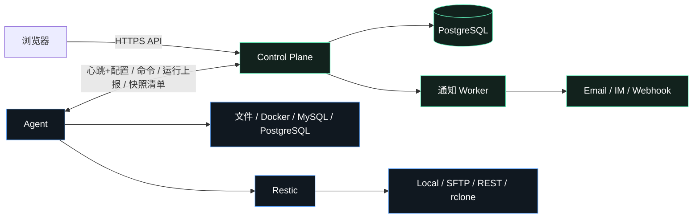

# VaultMesh 架构说明

> 本文档描述当前已实现的系统结构与关键状态机。产品路线与决策背景见《[VaultMesh 项目说明书](../VaultMesh-项目说明书.md)》。

## 系统组成

VaultMesh 由三个独立部署单元组成：



| 单元 | 入口 | 职责 | 不做什么 |
|---|---|---|---|
| Control Plane | `cmd/vaultmesh-server` | 策略存储、配置收敛、运行事实、告警、审计；单进程 + PostgreSQL | 不接触备份正文；不执行源服务器命令 |
| Agent | `cmd/vaultmesh-agent` | 本地调度备份/维护/恢复；持久化状态；离线自治 | 不提供远程 Shell；只接受强类型命令 |
| Web | `web/` | 管理界面，独立镜像与端口 | 不持有 Secret；会话由控制面 Cookie 承载 |

## 目录结构

```text
cmd/            两个二进制入口
internal/
  control/      业务服务 + HTTP 层
    http.go               路由表与服务器装配
    middleware.go         认证/CORS/日志/审计包装
    jsonio.go             请求解码与错误响应
    auth_api.go           登录、会话、限速
    admin_api.go          服务器/仓库/项目/运行/审计 handlers
    notifications_api.go  通知渠道/事件/投递 handlers
    agent_api.go          enroll、合并心跳、命令、运行、清单上报
    run_report.go         运行报告校验与时钟偏移规则
    service.go            领域服务（配置下发、健康推导、归档）
    alerts.go             告警事实推导与通知 Worker
  agent/        调度器（manager）、执行器（runner）、状态持久化（state）、快照（snapshots）
  store/        Store 接口 + memory/postgres 双实现
  domain/       跨层结构与常量
  config/       控制面环境变量
  schedule/     Cron 解析
  secret/       主密钥 Seal/Open
web/            Vue 3 + TypeScript
  src/views/    Tab 级组件（模板 + Tab 内部状态）
  src/composables/  可测试的前端状态机
  src/services/ 唯一允许声明 API 路径的类型化客户端
```

依赖方向与更多约定见《[开发与扩展指南](./DEVELOPMENT.md)》。

## 关键状态机

### 运行事实（Run）

由 Agent 生成并上报，控制面以幂等键（`projectID:operation:scheduledAt` 或 `manual:<commandID>`）去重：

```text
running ──▶ succeeded | partial | failed | timed_out | canceled | skipped
        └─（Agent 重启补报）▶ unknown
```

- 终态不可回退：PostgreSQL 侧 `UpsertRun` 仅允许覆盖 `running` 状态行。
- `skipped` 是 `concurrency_policy=forbid` 下重叠触发的显式终态，不触发失败告警。
- 控制面保留策略（`VAULTMESH_RETENTION_RUNS_DAYS`，默认 90 天）只清理已终态的运行。

### 配置收敛（DesiredConfig）

```text
项目变更/归档 → server.desired_revision++ 
  → Agent 心跳（携带 applied_revision）
  → 落后则响应返回完整配置（解密仓库凭据、追加 /<serverID> 路径隔离）
  → Agent 本地校验并原子化持久化，回滚 revision 会被拒绝
    （控制面从备份恢复后可用一次性 --accept-rollback 放行）
```

任何项目凭据解密失败只降级该项目并产生 `config_error` 告警，不影响同台 Agent 其他项目。

### 命令生命周期（手动备份/浏览/恢复）

```text
created ──▶ leased（2 分钟租约，可重领）──▶ accepted ──▶ completed
```

`accepted/completed` 由对应运行报告（幂等键 `manual:<commandID>`）在 `UpsertRun` 中同事务回写，不存在独立的命令确认接口。

### 快照索引

每个成功备份/手动同步后，Agent 将完整 Restic 清单写入本地持久化 Outbox，经专用幂等端点 `PUT /api/v1/agent/snapshots` 交付；控制面按 `synced_at` 单调性拒绝旧清单覆盖新清单。清单超限（>10000 条）时 Agent 丢弃并在运行事实中标记 `snapshot_inventory_dropped`。

### 告警与通知

```text
EvaluateAlerts（30s）──▶ 按 fingerprint 聚合为 Incident（firing → repeat → resolved）
       └─▶ 匹配渠道（event_types + project/server allowlist）
             └─▶ Delivery 队列：指数退避重试 5 次，重复提醒按 repeat_interval 分桶去重
```

事件：`backup_failure`、`rpo_overdue`、`agent_offline`、`config_error`。通知发送失败不改变运行事实。

## 安全模型

| 层 | 机制 |
|---|---|
| 凭据 | 全部 Secret（仓库凭据、数据库密码、通知渠道配置）以 `VAULTMESH_MASTER_KEY` 经 AEAD 封装存储；API 响应永不回显 |
| Agent 身份 | 一次性注册令牌 + 独立设备凭据（仅存 SHA-256）；归档服务器即吊销凭据 |
| 管理员 | 密码 + TOTP/通行密钥 + 恢复码；渐进限速；敏感操作重新认证；全程审计 |
| 出站 | 通知渠道与 Agent 控制面 URL 均有 SSRF 防护（私网默认禁止、禁止重定向、URL 凭据拒绝） |
| 数据面 | 备份正文由 Agent 直传仓库；控制面仅存元数据与加密凭据 |

## 生命周期管理

- **归档**：服务器/项目/仓库软删除。项目归档 bump revision 将其从 Agent 配置摘除；服务器归档吊销设备凭据；仓库归档要求无活跃项目引用。历史运行与审计保留。
- **保留**：运行/命令/投递/已恢复事件/审计五个 scope 独立配置天数；进行中的运行、待投递通知、firing 事件永不清理。

## 扩展点

新增能力时必须同步的清单见《[开发与扩展指南](./DEVELOPMENT.md)》：数据源类型、仓库 Provider、通知渠道、前端 Tab。所有扩展保持 memory/postgres 双存储语义对齐，并有 API 契约测试兜底路由文档。
