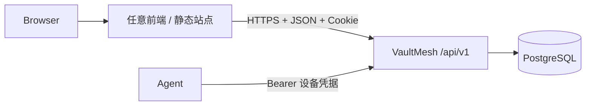
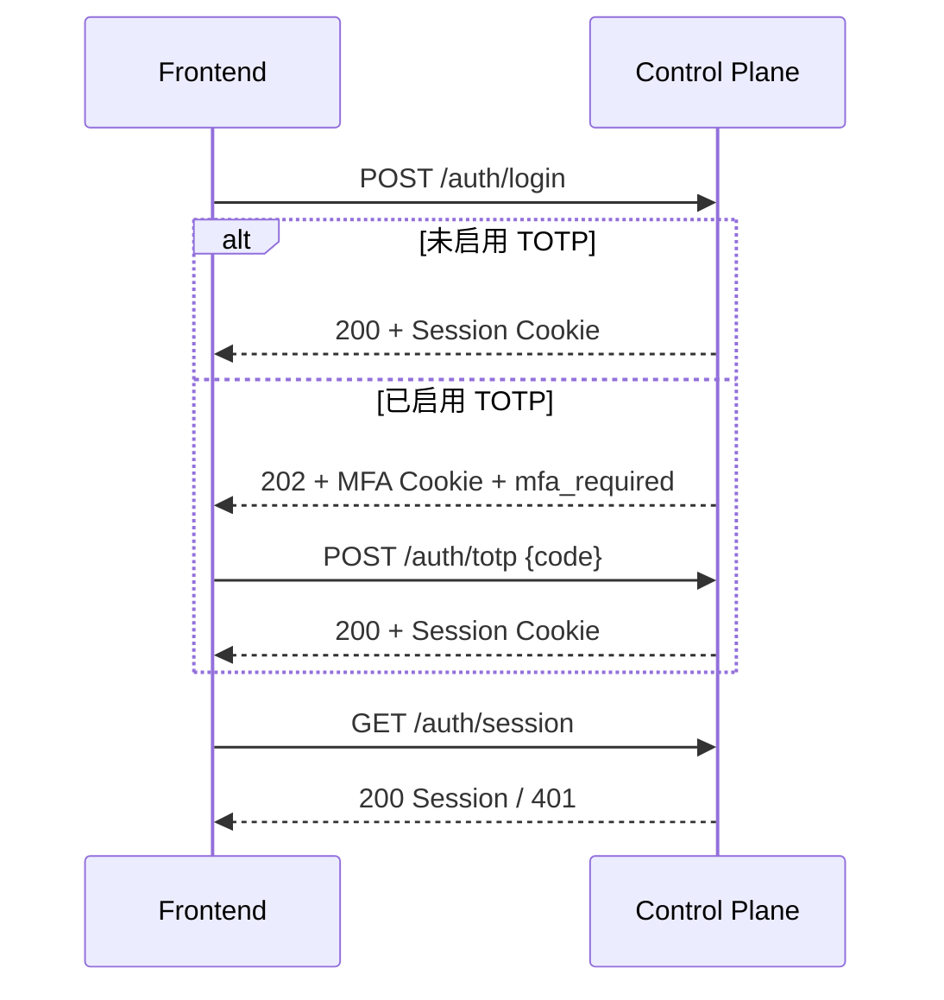

# VaultMesh 前端 API 对接指南

本文面向替换管理界面主题、开发独立 Web 控制台或接入桌面壳的前端开发者。接口机器可读契约见 [OpenAPI 3.1 文档](./openapi.yaml)，业务语义和完整示例见 [API Reference](./API.md)。

## 1. 前后端边界

VaultMesh Control Plane 是纯 JSON API 服务：

- 不托管 HTML、CSS、JavaScript 或图片；
- 未匹配的路径返回 JSON `404`，不会回退到 `index.html`；
- 浏览器接口固定在 `/api/v1`；
- API 与 Web 使用独立镜像、容器、端口和发布周期；
- Web 只需要一个浏览器可访问的 API Base URL；
- 更换主题不需要重新编译或修改 Go 后端。



官方 Web 的接口边界如下：

| 文件 | 责任 |
|---|---|
| `src/api.ts` | Base URL、`fetch`、Cookie、JSON、统一错误解析 |
| `src/services/control-plane.ts` | 版本化路径、请求 DTO、响应类型和资源方法 |
| `src/services/index.ts` | 稳定导出入口，页面和新主题只从这里使用 API |
| `src/types.ts` | 服务端响应 DTO |
| `src/forms` | 可选的表单草稿与 API DTO 转换，不包含请求逻辑 |
| `src/App.vue` 和页面组件 | 交互状态与展示，不允许出现 API 路径或直接 `fetch` |

`npm run check:architecture` 会强制执行这个边界，并且已经包含在生产构建中。

## 2. API 地址配置

API Base URL 必须是绝对 HTTP/HTTPS URL，不能包含用户名、密码、查询参数或 Fragment，也不能带 `/api/v1` 后缀。

官方 Web 的解析优先级：

1. 运行时 `/config.txt`；
2. 构建变量 `VITE_API_BASE_URL`；
3. Vite 开发模式默认 `http://localhost:8080`。

容器部署示例：

```env
VAULTMESH_API_BASE_URL=https://api.backup.example.com
```

自定义前端可以使用自己的配置系统，但最终请求地址应形如：

```text
https://api.backup.example.com/api/v1/dashboard
```

HTTPS 页面不能连接 HTTP API，否则浏览器会阻止 Mixed Content。

## 3. 浏览器认证与跨域

管理员认证使用服务端会话 Cookie，不向 Web 页面返回管理员 Bearer Token。所有浏览器请求必须使用：

```ts
fetch(`${apiBaseURL}/api/v1/dashboard`, {
  credentials: 'include',
  headers: { Accept: 'application/json' },
})
```

Control Plane 必须精确允许前端 Origin：

```env
VAULTMESH_ALLOWED_ORIGINS=https://console.example.com
```

不支持 `*`。多个可信前端用逗号分隔，并且 Origin 不能带尾随 `/`、路径、查询参数或凭据。

### 部署模式

| 前端与 API | 示例 | Cookie 设置 |
|---|---|---|
| 同一站点、不同 Origin | `console.example.com` → `api.example.com` | `VAULTMESH_COOKIE_SAME_SITE=lax`，生产启用 Secure |
| 完全不同站点 | `console.example.net` → `api.example.com` | `VAULTMESH_COOKIE_SAME_SITE=none` 且 `VAULTMESH_COOKIE_SECURE=true` |
| 本地开发 | `localhost:5173` → `localhost:8080` | `lax`、`COOKIE_SECURE=false` |

`SameSite=None` 只允许与 Secure Cookie 同时启用。跨站模式仍受精确 CORS Origin、JSON Content-Type 预检和 Origin 校验保护。

浏览器可读取 `Retry-After` 和 `X-VaultMesh-API-Version` 响应头。API 会返回：

```http
Access-Control-Allow-Credentials: true
Access-Control-Expose-Headers: Retry-After, X-VaultMesh-API-Version
X-VaultMesh-API-Version: 1
```

## 4. JSON 请求约定

- 有正文的请求必须发送 `Content-Type: application/json`；
- 服务端拒绝未知字段；
- 每个请求只能包含一个 JSON 值；
- 请求正文最大 1 MiB；
- 所有成功 JSON 响应使用 `application/json; charset=utf-8`；
- `204 No Content` 没有响应正文；
- 所有 `/api/` 响应带 `Cache-Control: no-store`；
- 时间使用 RFC 3339 UTC 字符串；
- 列表统一返回 `{ "items": [...] }`；
- 异步 Agent 操作返回 HTTP `202` 和 Command 对象，不能当作任务已经完成。

推荐请求封装：

```ts
type APIErrorBody = {
  error: {
    code: string
    message: string
    details: unknown
  }
}

async function request<T>(baseURL: string, path: string, body?: unknown): Promise<T> {
  const response = await fetch(`${baseURL}${path}`, {
    method: body === undefined ? 'GET' : 'POST',
    credentials: 'include',
    headers: {
      Accept: 'application/json',
      ...(body === undefined ? {} : { 'Content-Type': 'application/json' }),
    },
    body: body === undefined ? undefined : JSON.stringify(body),
  })
  if (!response.ok) throw await response.json() as APIErrorBody
  if (response.status === 204) return undefined as T
  return await response.json() as T
}
```

生产前端应复用 [官方类型化服务层](../web/src/services/control-plane.ts)，避免在组件中重复实现路径和请求结构。

## 5. 错误模型

所有 API 错误使用相同结构：

```json
{
  "error": {
    "code": "validation_failed",
    "message": "must contain 1 to 100 characters",
    "details": {
      "field": "name"
    }
  }
}
```

前端逻辑应使用稳定的 `error.code`，不要解析英文 `message`。

| HTTP | 常见 code | 前端处理 |
|---:|---|---|
| 400 | `invalid_json`, `origin_required` | 修正请求或部署配置 |
| 401 | `unauthorized`, `invalid_credentials`, `invalid_second_factor` | 返回登录页或提示重新验证 |
| 403 | `origin_forbidden` | 检查 `VAULTMESH_ALLOWED_ORIGINS` |
| 404 | `not_found` | 刷新资源列表 |
| 409 | `conflict` | 提示状态冲突并重新加载 |
| 415 | `unsupported_media_type` | 使用 JSON Content-Type |
| 422 | `validation_failed` | 根据 `details.field` 标记表单字段 |
| 428 | `reauthentication_required` | 调用重新认证接口后重试敏感操作 |
| 429 | `rate_limited` | 读取 `Retry-After`，禁用提交按钮并倒计时 |
| 500 | `internal_error` | 显示通用错误，不展示或猜测服务端 Secret |

## 6. 登录状态机

### 密码与 TOTP



页面启动时先调用 `GET /api/v1/auth/session`。HTTP `200` 表示已有会话，`401` 表示显示登录页。不要通过读取 Cookie 判断登录状态，因为 Cookie 为 HttpOnly。

### 通行密钥

1. `POST /api/v1/auth/passkey/begin`；
2. 把响应 `publicKey` 中的 Base64URL 字段转换为 `ArrayBuffer`；
3. 调用 `navigator.credentials.get()`；
4. 序列化 Assertion 并提交 `/auth/passkey/finish`；
5. 服务端设置会话 Cookie。

注册通行密钥使用 `/profile/passkeys/register/begin` 和 `/finish`。遇到 `428 reauthentication_required` 时，先调用 `/profile/reauthenticate`，然后重新开始 Ceremony。不要重用已经开始的 WebAuthn Challenge。

WebAuthn RP ID 与允许 Origin 必须匹配新前端域名。更换主题但不更换域名时无需修改；更换域名时必须同步配置 `VAULTMESH_WEBAUTHN_RP_ID` 和 `VAULTMESH_WEBAUTHN_RP_ORIGINS`。修改 RP ID 会导致已有通行密钥失效。

## 7. 管理界面端点清单

| 领域 | 方法与路径 | 用途 |
|---|---|---|
| 元信息 | `GET /api/v1/meta` | API 版本和构建信息 |
| 认证 | `/api/v1/auth/*` | 密码、TOTP、通行密钥、会话与退出 |
| 个人安全 | `/api/v1/profile/*` | 密码、TOTP、恢复码、通行密钥 |
| 仪表盘 | `GET /api/v1/dashboard` | 汇总指标 |
| 服务器 | `GET/POST /api/v1/servers` | Agent 节点和一次性注册 |
| 仓库 | `GET/POST /api/v1/repositories` | 全局备份渠道 |
| 项目 | `GET/POST /api/v1/projects` | 项目列表与创建 |
| 项目状态 | `PUT/PATCH /api/v1/projects/{id}` | 替换配置或暂停/恢复 |
| 执行 | `POST /projects/{id}/run` | 立即备份 |
| 保留 | `POST /projects/{id}/retention-preview` | 只读清理预览 |
| 健康 | `GET /api/v1/project-health` | RPO 推导结果 |
| 快照 | `GET /api/v1/snapshots` | 快照索引 |
| 恢复 | `/projects/{id}/snapshots/{snapshotID}/*` | 保护、浏览和隔离恢复 |
| 运行 | `GET /api/v1/runs` | 运行与异步命令结果 |
| 通知 | `/api/v1/notification-channels` | 联系点 CRUD 与测试 |
| 告警 | `/api/v1/alert-incidents`, `/notification-deliveries` | 告警和投递历史 |
| 审计 | `GET /api/v1/audit-events` | 管理操作证据 |

字段、状态码和 Schema 以 [openapi.yaml](./openapi.yaml) 为准。

## 8. 新主题最低实现流程

一个可用的新管理主题至少需要：

1. 加载并校验 API Base URL；
2. 使用 `credentials: 'include'` 实现会话检测和登录；
3. 处理密码登录的 `200/202` 两条分支；
4. 全局处理 `401`、`428`、`429` 和统一错误结构；
5. 从 `/servers`、`/repositories`、`/projects` 建立资源关系；
6. 把 `202` 操作显示为“已排队”，通过 `/runs` 获取最终结果；
7. 对仓库凭据、数据库密码和通知 Secret 使用写入后不回显的 UI；
8. 不把密码、TOTP、恢复码、Webhook URL 或访问密钥写入日志、URL、LocalStorage；
9. 使用完整 64 位 Snapshot ID 发起保护、浏览和恢复；
10. 在独立 Origin 环境完成 CORS、Cookie、TOTP 和 WebAuthn 验收。

只要遵循本契约，新主题可以使用 Vue、React、Svelte 或纯静态 JavaScript，后端无需感知前端框架。
